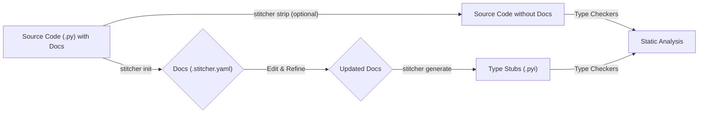

# Stitcher


**Stitching the gap between dynamic code and static analysis.**

[English](./README.md) | [中文](./README.zh.md)

---

## What is Stitcher?

Stitcher is a Python development tool designed to decouple documentation from your source code. It treats docstrings as first-class assets, extracting them into external `.yaml` files. These external documents then become the single source of truth, used to "stitch" rich, type-aware `.pyi` stub files.

This approach solves several common problems in Python development:
-   **Code Bloat:** It keeps your source code lean and focused on logic by moving extensive docstrings out of the way.
-   **Static Analysis for Dynamic Code:** It allows you to provide detailed documentation and type hints for dynamically generated objects (e.g., from plugins, metaprogramming) that static analysis tools like MyPy or Pyright would otherwise miss.
-   **Documentation Management:** Managing documentation in structured YAML files is often easier than in multi-line Python strings, especially for complex APIs or multi-language teams.
-   **Consistency:** By generating stubs from a single source of truth, it ensures your inline help, type hints, and external documentation are always in sync.

## Key Features

-   **📄 Docstring Decoupling:** Extract docstrings from your code into clean, manageable `.stitcher.yaml` sidecar files.
-   **🧬 Stub Generation:** Generate PEP 561-compliant `.pyi` type stubs, enriching them with the external documentation.
-   **📦 Stub Packages:** Automatically scaffold and manage dedicated stub packages (e.g., `my-package-stubs`) for clean distribution.
-   **🔍 Consistency Checking:** A powerful `check` command verifies that your code's structure hasn't diverged from its documentation, detecting signature changes, missing docs, and dangling docs.
-   **🔌 Plugin System:** Define and document functions from external or dynamic sources and stitch them into your project's type stubs.
-   **⚙️ Flexible Configuration:** Configure everything through `pyproject.toml`, with support for monorepos and multiple generation targets.
-   ** ciclo de vida completo:** Supports the full lifecycle: `init` to extract, `generate` to build, `strip` to clean, `hydrate` to update, and `eject` to move docs back into code if you decide to stop using Stitcher.

## Core Workflow

Stitcher's workflow is designed to be intuitive and integrate seamlessly with version control.



1.  **Initialize (`stitcher init`)**
    -   Stitcher scans your source code and extracts all existing docstrings.
    -   It creates corresponding `.stitcher.yaml` files alongside your `.py` files, containing the extracted documentation.
    -   At this point, you can commit these new YAML files.

2.  **Document & Refine**
    -   Edit the `.stitcher.yaml` files to add, improve, or translate your documentation. This is where you can also add docstrings for dynamic objects that don't physically exist in the source code.

3.  **Strip (Optional, `stitcher strip`)**
    -   Once your docs are safely managed in YAML files, you can run the `strip` command to remove all docstrings from your Python source files, keeping your code clean and concise.

4.  **Generate (`stitcher generate`)**
    -   This is the core "stitching" process.
    -   Stitcher reads your (now potentially docstring-less) source code to understand its structure (classes, methods, signatures).
    -   It then reads the `.stitcher.yaml` files to get the documentation.
    -   Finally, it combines this information to generate complete, well-documented `.pyi` stub files in the location you've configured.

5.  **Check (`stitcher check`)**
    -   Run this command in your CI/CD pipeline or locally.
    -   It ensures consistency by checking for:
        -   Functions/methods whose signatures have changed, potentially making their docs obsolete.
        -   New public code that is missing documentation.
        -   Documentation for code that no longer exists.
        -   Docstrings that are present in both the source code and YAML files (redundancy).

## Installation

Since this project is not yet available on PyPI, you need to install it from a local clone.

1.  **Clone the repository:**
    ```bash
    git clone https://github.com/doucx/stitcher-python.git
    cd stitcher-python
    ```

2.  **Create and activate a virtual environment:**
    ```bash
    python -m venv .venv
    source .venv/bin/activate
    # On Windows: .venv\Scripts\activate
    ```

3.  **Install the project in editable mode with development dependencies:**
    ```bash
    pip install -e .[dev]
    ```
    This command installs all the necessary packages for running and developing Stitcher, including the `stitcher` CLI tool.

## Usage (CLI Commands)

All commands are run from the root of your project (where `pyproject.toml` is located).

-   `stitcher init`
    Scans the project for source files with docstrings and creates the initial `.stitcher.yaml` documentation files.

-   `stitcher generate`
    Generates `.pyi` stub files based on the current code structure and the content of the `.stitcher.yaml` files.

-   `stitcher check`
    Verifies consistency between your source code, signatures, and documentation files. Exits with a non-zero status code if critical issues are found, making it ideal for CI.

-   `stitcher hydrate`
    Scans the source code for any *new* docstrings and merges them into the existing `.stitcher.yaml` files. This is useful when you add new code and write the initial docstrings in the code itself.
    -   `--strip`: After a successful hydration, remove the docstrings from the source code.
    -   `--force`: If a docstring exists in both code and YAML but the content differs, the version from the code wins.
    -   `--reconcile`: If a conflict occurs, the version from the YAML file wins (the source code version is ignored).

-   `stitcher strip`
    Removes all docstrings from all source files defined in your configuration. **This is a destructive action; ensure your code is under version control.**

-   `stitcher eject`
    The "undo" operation. This command injects the documentation from all `.stitcher.yaml` files back into your `.py` source files. This is useful if you want to stop using Stitcher.

## Configuration

Stitcher is configured via the `[tool.stitcher]` section in your `pyproject.toml` file.

It supports multiple targets, which is perfect for monorepos containing different packages.

**Example from this project's `pyproject.toml`:**

```toml
[tool.stitcher.targets.stitcher]
# Paths to scan for the 'stitcher' package group
scan_paths = [
    "packages/stitcher-spec/src",
    "packages/stitcher-common/src",
    "packages/stitcher-scanner/src",
    "packages/stitcher-io/src",
    "packages/stitcher-config/src",
    "packages/stitcher-application/src",
    "packages/stitcher-cli/src",
    "packages/stitcher-test-utils/src",
]
# Generate stubs into a dedicated PEP 561 stub package
stub_package = "packages/stitcher-stubs"

[tool.stitcher.targets.needle]
# Paths to scan for the 'needle' package group
scan_paths = [
    "packages/pyneedle-spec/src",
    "packages/pyneedle-pointer/src",
    "packages/pyneedle-nexus/src",
    "packages/pyneedle/src",
]
stub_package = "packages/needle-stubs"
```

**Key Configuration Options:**
-   `scan_paths`: (Required) A list of directories or files to scan for source code.
-   `stub_package`: (Recommended) The path to a directory that will be structured as a PEP 561 stub package. Stitcher will scaffold it for you.
-   `stub_path`: An alternative to `stub_package`. Specifies a single directory where all generated `.pyi` files will be placed.

## License

This project is licensed under the Apache License, Version 2.0. See the [LICENSE](./LICENSE) file for details.
