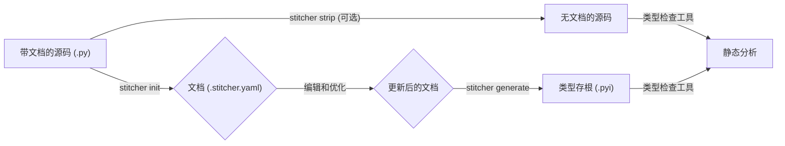

# Stitcher


**缝合动态代码与静态分析之间的鸿沟。**

[English](./README.md) | [中文](./README.zh.md)

---

## 什么是 Stitcher?

Stitcher 是一个 Python 开发工具，旨在将文档与源代码解耦。它将文档字符串 (docstrings) 视作一等公民的资产，将其提取到外部的 `.yaml` 文件中。这些外部文档随后成为单一事实来源 (single source of truth)，用于“缝合”出内容丰富且类型感知的 `.pyi` 存根文件。

这种方法解决了 Python 开发中的几个常见问题：
-   **代码臃肿：** 通过将冗长的文档字符串移出，让您的源代码保持精简，专注于业务逻辑。
-   **为动态代码提供静态分析支持：** 它允许您为动态生成的对象（例如，来自插件、元编程的对象）提供详细的文档和类型提示，而这些是 MyPy 或 Pyright 等静态分析工具通常无法识别的。
-   **文档管理：** 在结构化的 YAML 文件中管理文档通常比在多行 Python 字符串中更容易，特别是对于复杂的 API 或多语言团队。
-   **一致性：** 通过从单一事实来源生成存根，确保您的内联帮助、类型提示和外部文档始终保持同步。

## 核心功能

-   **📄 文档解耦：** 将文档字符串从您的代码中提取到整洁、易于管理的 `.stitcher.yaml` 边车文件中。
-   **🧬 存根生成：** 生成符合 PEP 561 规范的 `.pyi` 类型存根，并用外部文档丰富其内容。
-   **📦 存根包：** 自动为清晰的分发搭建和管理专用的存根包（例如 `my-package-stubs`）。
-   **🔍 一致性检查：** 强大的 `check` 命令可以验证您的代码结构是否与文档偏离，检测签名变更、文档缺失和悬空文档。
-   **🔌 插件系统：** 定义和记录来自外部或动态来源的函数，并将它们缝合到项目的类型存根中。
-   **⚙️ 灵活配置：** 通过 `pyproject.toml` 配置所有内容，支持 monorepo 和多个生成目标。
-   **🔁 全生命周期支持：** 支持完整的生命周期：`init` 用于提取，`generate` 用于构建，`strip` 用于清理，`hydrate` 用于更新，以及 `eject` 用于在您决定停用 Stitcher 时将文档移回代码中。

## 核心工作流

Stitcher 的工作流设计直观，并能与版本控制无缝集成。



1.  **初始化 (`stitcher init`)**
    -   Stitcher 扫描您的源代码并提取所有现有的文档字符串。
    -   它会在您的 `.py` 文件旁边创建相应的 `.stitcher.yaml` 文件，其中包含提取的文档。
    -   此时，您可以提交这些新的 YAML 文件。

2.  **文档编写与优化**
    -   编辑 `.stitcher.yaml` 文件以添加、改进或翻译您的文档。您也可以在这里为源代码中物理上不存在的动态对象添加文档字符串。

3.  **剥离 (可选, `stitcher strip`)**
    -   一旦您的文档安全地由 YAML 文件管理，您可以运行 `strip` 命令，从 Python 源文件中移除所有文档字符串，使您的代码保持干净和简洁。

4.  **生成 (`stitcher generate`)**
    -   这是核心的“缝合”过程。
    -   Stitcher 读取您的（现在可能没有文档字符串的）源代码以理解其结构（类、方法、签名）。
    -   然后，它读取 `.stitcher.yaml` 文件以获取文档。
    -   最后，它将这些信息结合起来，在您配置的位置生成完整、文档齐全的 `.pyi` 存根文件。

5.  **检查 (`stitcher check`)**
    -   在您的 CI/CD 流程中或本地运行此命令。
    -   它通过检查以下内容来确保一致性：
        -   函数/方法的签名是否已更改，这可能使其文档过时。
        -   新的公开代码是否缺少文档。
        -   文档对应的代码是否已不复存在。
        -   文档字符串是否同时存在于源代码和 YAML 文件中（冗余）。

## 安装

由于本项目尚未发布到 PyPI，您需要从本地克隆进行安装。

1.  **克隆仓库：**
    ```bash
    git clone https://github.com/doucx/stitcher-python.git
    cd stitcher-python
    ```

2.  **创建并激活虚拟环境：**
    ```bash
    python -m venv .venv
    source .venv/bin/activate
    # 在 Windows 上: .venv\Scripts\activate
    ```

3.  **以可编辑模式安装项目及其开发依赖：**
    ```bash
    pip install -e .[dev]
    ```
    此命令将安装运行和开发 Stitcher 所需的所有包，包括 `stitcher` 命令行工具。

## 使用方法 (CLI 命令)

所有命令都在您的项目根目录（`pyproject.toml` 所在的位置）下运行。

-   `stitcher init`
    扫描项目中的源文件，提取文档字符串，并创建初始的 `.stitcher.yaml` 文档文件。

-   `stitcher generate`
    基于当前的代码结构和 `.stitcher.yaml` 文件的内容生成 `.pyi` 存根文件。

-   `stitcher check`
    验证源代码、函数签名和文档文件之间的一致性。如果发现严重问题，将以非零状态码退出，非常适合在 CI 中使用。

-   `stitcher hydrate`
    扫描源代码中任何*新*的文档字符串，并将它们合并到现有的 `.stitcher.yaml` 文件中。当您添加新代码并在代码中编写初始文档时，此功能非常有用。
    -   `--strip`: 成功“补水”后，从源代码中移除这些文档字符串。
    -   `--force`: 如果代码和 YAML 中都存在某个文档字符串但内容不同，则以代码中的版本为准。
    -   `--reconcile`: 如果发生冲突，则以 YAML 文件中的版本为准（忽略源代码中的版本）。

-   `stitcher strip`
    从您配置中定义的所有源文件中移除所有文档字符串。**这是一个破坏性操作，请确保您的代码已纳入版本控制。**

-   `stitcher eject`
    “撤销”操作。此命令将所有 `.stitcher.yaml` 文件中的文档注入回您的 `.py` 源文件中。如果您想停止使用 Stitcher，此功能会很有帮助。

## 配置

Stitcher 通过 `pyproject.toml` 文件中的 `[tool.stitcher]` 部分进行配置。

它支持多个目标 (target)，非常适合包含不同包的 monorepo。

**本项目的 `pyproject.toml` 示例：**

```toml
[tool.stitcher.targets.stitcher]
# 为 'stitcher' 包组扫描的路径
scan_paths = [
    "packages/stitcher-spec/src",
    "packages/stitcher-common/src",
    "packages/stitcher-scanner/src",
    "packages/stitcher-io/src",
    "packages/stitcher-config/src",
    "packages/stitcher-application/src",
    "packages/stitcher-cli/src",
    "packages/stitcher-test-utils/src",
]
# 将存根生成到一个专用的 PEP 561 存根包中
stub_package = "packages/stitcher-stubs"

[tool.stitcher.targets.needle]
# 为 'needle' 包组扫描的路径
scan_paths = [
    "packages/pyneedle-spec/src",
    "packages/pyneedle-pointer/src",
    "packages/pyneedle-nexus/src",
    "packages/pyneedle/src",
]
stub_package = "packages/needle-stubs"
```

**关键配置选项：**
-   `scan_paths`: (必需) 一个要扫描源代码的目录或文件列表。
-   `stub_package`: (推荐) 一个目录的路径，该目录将被构建为一个 PEP 561 存根包。Stitcher 会为您搭建好它。
-   `stub_path`: `stub_package` 的替代方案。指定一个单一目录，所有生成的 `.pyi` 文件都将放置在该目录中。

## 许可证

本项目采用 Apache License, Version 2.0 许可证。详情请参阅 [LICENSE](./LICENSE) 文件。
